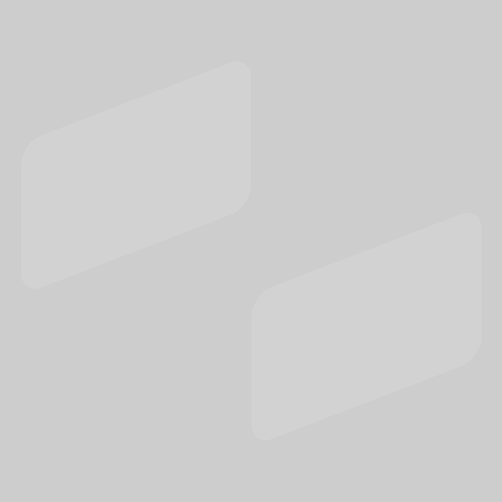
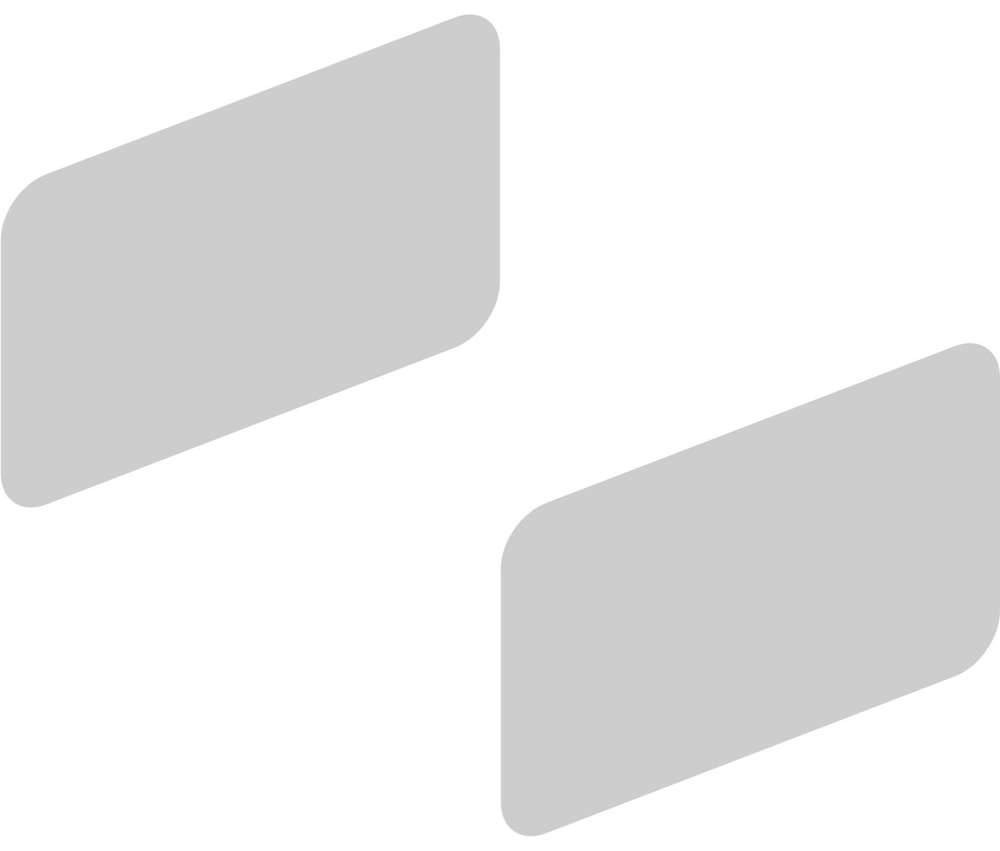
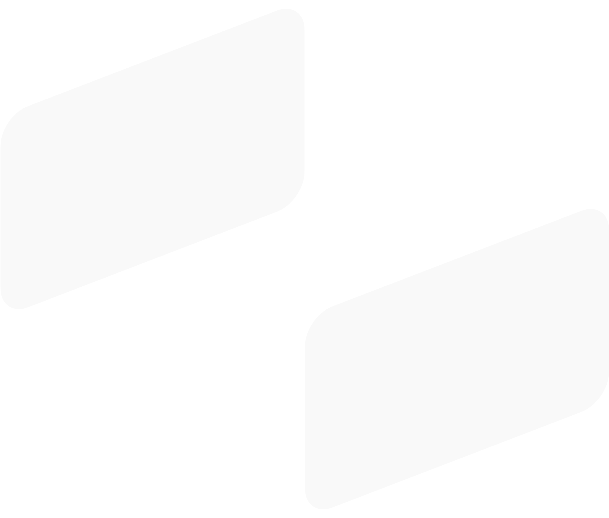

# [Asset]&#x2001;👨🏻‍🎨

<p align="center">
	<a href="https://github.com/CodeEditorLand/Asset/tree/Current"></a>
</p>

<p align="center">
	<a href="https://github.com/CodeEditorLand/Asset/tree/Current/LICENSE"></a>
	<a href="https://github.com/CodeEditorLand/Asset/tree/Current"></a>
	<a href="https://github.com/CodeEditorLand/Asset/tree/Current"></a>
</p>

Asset is the brand asset repository for Code Editor Land, home to the logos, glyphs, and Figma source files used across the website, editor, and GitHub profiles.

Nothing here is built or compiled. The repository is a design source of truth: every mark is committed as both vector and raster, in light, dark and transparent variants, so any other repository can hot-link a file instead of vendoring a copy of it.

## Orientation&#x2001;🧭

| Repository | What it holds | Relation to Asset |
| --- | --- | --- |
| [Asset](https://github.com/CodeEditorLand/Asset/tree/Current) | Logos, glyphs, avatars, Figma sources | This repository |
| [Land](https://github.com/CodeEditorLand/Land/tree/Current) | The editor and its Element sub-repositories | Consumes the marks |
| [WebSite](https://github.com/CodeEditorLand/WebSite/tree/Current) | The [Editor.Land](https://Editor.Land) site | Consumes the marks |
| [StatusWebSite](https://github.com/CodeEditorLand/StatusWebSite/tree/Current) | The status page | Consumes the marks |
| [Workers](https://github.com/CodeEditorLand/Workers/tree/Current) | Edge workers behind the site | Consumes the marks |

> [!IMPORTANT]
>
> The default branch is `Current`, not `main` - permalinks and raw URLs must say `Current` or they will 404.

## Repository Map&#x2001;🗂️

| Path | Contents |
| --- | --- |
| [Logo/](https://github.com/CodeEditorLand/Asset/tree/Current/Logo) | Light-mode primary logo, plus `Glyph/` and `Square/` variants |
| [Dark/](https://github.com/CodeEditorLand/Asset/tree/Current/Dark) | Dark-mode mirror of `Logo/` and `Avatar/` |
| [Transparent/](https://github.com/CodeEditorLand/Asset/tree/Current/Transparent) | Transparent-background cuts, including a `Dark/` sub-tree |
| [Avatar/](https://github.com/CodeEditorLand/Asset/tree/Current/Avatar) | GitHub and profile avatars |
| [Artboard/](https://github.com/CodeEditorLand/Asset/tree/Current/Artboard) | Figma artboard exports |
| [Maintain/](https://github.com/CodeEditorLand/Asset/tree/Current/Maintain) | Raster maintenance scripts |
| [Logo.fig](https://github.com/CodeEditorLand/Asset/tree/Current/Logo.fig) | Figma source file for the logos |

**`Logo/`, `Dark/`, `Transparent/`, `Avatar/`**

```text
Logo/Land.svg              Logo/Glyph/Land.svg        Logo/Square/Glyph/Land.svg
Dark/Logo/Land.svg         Dark/Logo/Glyph/Land.svg   Dark/Logo/Square/Glyph/Land.svg
Transparent/Logo/Land.svg  Transparent/Avatar/Land.svg
Avatar/Land.svg            Avatar/Glyph/Land.svg      Artboard/Masthead.png
```

> [!NOTE]
>
> The four trees mirror one another, so a path learned in `Logo/` translates directly into `Dark/` and `Transparent/`.

## Logo:&#x2001;🖼️




The full lockup: the mark set beside the wordmark. Reach for it wherever there is horizontal room - a README header, a site masthead, a conference slide.

**`Logo/Land.svg`**


> [!TIP]
>
> Prefer the `.svg` for anything that scales and keep the `.png` for surfaces that refuse vector input.

### Square Crops&#x2001;🔲

**`Logo/Square/Glyph/Land.svg`**

```text
Logo/Square/Glyph/Land.svg
Dark/Logo/Square/Glyph/Land.svg
Transparent/Dark/Logo/Land.svg
```

> [!NOTE]
>
> Square cuts exist for tiles and app icons, where a wide lockup would be letterboxed into illegibility.

## Glyph:&#x2001;🔷





The mark on its own, with no wordmark. This is the favicon, the tab icon and the badge - anything under roughly 64 pixels, where the wordmark would smear.

**`Logo/Glyph/Land.svg`**


> [!TIP]
>
> Pair the light glyph with `Dark/Logo/Glyph/Land.svg` behind a `prefers-color-scheme` query.

## Figma:&#x2001;🎨

[Artboard](Artboard/)

[Logo](Logo.fig)

[Logo.fig](https://github.com/CodeEditorLand/Asset/tree/Current/Logo.fig) is the editable source; the [Artboard](https://github.com/CodeEditorLand/Asset/tree/Current/Artboard) directory holds its flattened exports, one per composition.

**`Artboard/`**

```text
Artboard/Foundation Land.png    Artboard/Service Land.png
Artboard/Foundation Tauri.png   Artboard/Service Tauri.png
Artboard/Masthead.png
```

> [!IMPORTANT]
>
> Edit `Logo.fig` and re-export - never hand-patch an artboard PNG, because the next export will overwrite it.

## Avatar&#x2001;🪪

Avatars are the profile-picture cut of the mark, sized and padded for a circular crop rather than a page header.

**`Avatar/`**

```text
Avatar/Land.svg
Avatar/Glyph/Land.svg
Dark/Avatar/Land.svg
Transparent/Avatar/Community.png
```

> [!NOTE]
>
> `Transparent/Avatar/Community.png` is the community variant and is the one exception to the mirrored naming.

## Embedding an Asset&#x2001;🔗

Link to the raw file on the `Current` branch. Do not copy assets into another repository: a hot-link stays correct when a mark is redrawn.

**`Terminal`**

```text
https://raw.githubusercontent.com/CodeEditorLand/Asset/refs/heads/Current/Logo/Land.svg
https://raw.githubusercontent.com/CodeEditorLand/Asset/refs/heads/Current/Dark/Logo/Land.svg
```

> [!TIP]
>
> Swap the trailing path for any file in the map above; the prefix never changes.

## Maintenance&#x2001;🛠️

Two scripts keep the raster set small and tight. Both walk the tree with `find`, skipping `node_modules` and `.git`, and rewrite every PNG in place.

**`Maintain/Strip.sh`, `Maintain/Trim.sh`**

```sh
\find . -type d \( -iname node_modules -o -iname \.git \) -prune -false -o -iname '*.png' -exec convert {} -strip {} \;
\find . -type d \( -iname node_modules -o -iname \.git \) -prune -false -o -iname '*.png' -exec mogrify -trim +repage {} \;
```

> [!WARNING]
>
> [Strip.sh](https://github.com/CodeEditorLand/Asset/tree/Current/Maintain/Strip.sh) drops metadata and [Trim.sh](https://github.com/CodeEditorLand/Asset/tree/Current/Maintain/Trim.sh) crops whitespace, both in place and both requiring ImageMagick.

## Contributing&#x2001;🤝

Read [CONTRIBUTING.md](https://github.com/CodeEditorLand/Asset/tree/Current/CONTRIBUTING.md) and [CODE_OF_CONDUCT.md](https://github.com/CodeEditorLand/Asset/tree/Current/CODE_OF_CONDUCT.md) before opening a pull request. Released changes are recorded in [CHANGELOG.md](https://github.com/CodeEditorLand/Asset/tree/Current/CHANGELOG.md).

## License&#x2001;⚖️

[CC0 1.0 Universal](https://github.com/CodeEditorLand/Asset/tree/Current/LICENSE).

[Asset]: https://github.com/CodeEditorLand/Asset

## Funding&#x2001;🙏🏻

This project is funded through
[NGI0 Commons Fund](https://NLnet.NL/commonsfund), a fund established by
[NLnet](https://NLnet.NL) with financial support from the European Commission's
[Next Generation Internet](https://ngi.eu) program. Learn more at the
[NLnet project page](https://NLnet.NL/project/Land).

| Land                                                                                                                                                  | PlayForm                                                                                                                                                   | NLnet                                                                                        | NGI0 Commons Fund                                                                                                                                   |
| ----------------------------------------------------------------------------------------------------------------------------------------------------- | ---------------------------------------------------------------------------------------------------------------------------------------------------------- | -------------------------------------------------------------------------------------------- | --------------------------------------------------------------------------------------------------------------------------------------------------- |
| [](https://Editor.Land) | [](https://Editor.Land) | [](https://NLnet.NL) | [](https://NLnet.NL/commonsfund) |
